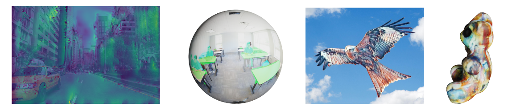

# SelectionConv: Convolutional Neural Networks for Non-rectilinear Image Data
The original Pytorch Geometric implementation for SelectionConv: Convolutional Neural Networks for Non-rectilinear Image Data, to be presented at ECCV 2022.

[Project Page](https://davidmhart.github.io/SelectionConv/)

[Paper](https://arxiv.org/abs/2207.08979)

## Install
This work relies heavily on the [Pytorch](https://pytorch.org/) and [Pytorch Geometric](https://www.pyg.org/) libraries. Make sure to have functioning versions of both libraries. The rest of the needed packages can be installed using the `requirements.txt` file.

This code was tested with Python 3.9, Pytorch 1.11 (CUDA Toolkit 11.3), and Pytorch Geometric 2.0.4 on Windows and Ubuntu Linux.

## Selection-based Convolution
One of the main contributions of the paper is the Selection-based Convolution layer. The code for this layer is provided in the file `selectionConv.py` and can be used in graph networks in the same way the regular 2D convolution layers are used in CNNs. See `graph_networks/` for examples of incorporating this layer into graph network setups. Also see our segmentation script for an example of how to automatically copy a 2D CNN fully into a graph network.

## Example Scripts
In the paper, we presented examples of various uses for Selection-based Convolution. The experiments shown can be replicated using the following scripts.

### Style Transfer
Panoramic image, spherical image, masked image, and 3D mesh style transfer can all be performed by using the `scripts/styletransfer.py` file. We use [Learning Linear Transformations for Fast Image and Video Style Transfer](https://openaccess.thecvf.com/content_CVPR_2019/papers/Li_Learning_Linear_Transformations_for_Fast_Image_and_Video_Style_Transfer_CVPR_2019_paper.pdf) by Li et. al. for our base style transfer method.

Setup:
- Download the needed weights from the [Github page](https://github.com/sunshineatnoon/LinearStyleTransfer) or the [Google drive](https://drive.google.com/file/d/1H9T5rfXGlGCUh04DGkpkMFbVnmscJAbs/view) link. Extract the models to `graph_networks/LinearStyleTransfer/models/`.
- We provide various example content images from our paper in `input_ims/` and various style images in `style_ims/`, but you can use images from any personal directory. An example command:

``python scripts/styletransfer.py input_ims/FlyingBird.jpg style_ims/style6.jpg --mask input_ims/FlyingBird_mask.jpg``

More examples commands are provided in `example.txt`.

Visualizations for many of examples are provided in the folder `visualizations/` and use the open-source [Blender](https://www.blender.org/) program. A viewer for 360 images is also provided in `360viewer.py`.

### Depth Prediction

For our depth prediction network, we use [Unsupervised Monocular Depth Estimation with Left-Right Consistency](https://github.com/mrharicot/monodepth). 
We the Pytorch implementation found at the [following repo](https://github.com/OniroAI/MonoDepth-PyTorch).
Download the weights [here](https://u.pcloud.link/publink/show?code=XZb5r97ZD7HDDlc237BMjoCbWJVYMm0FLKcy), and place them in `graph_networks/pretrained_weights/`

You can run depth prediction on superpixel images using the following command:

``python scripts/depth_prediction.py input_ims/street.jpg --image_type superpixel --device cpu``

### Segmentation

For our segmentation network, we use the built in ResNet50 network that is provided with Pytorch. To run a simple example using their pretrained weights, run:

``python scripts/segmentation.py input_ims/7fBQw.jpg --image_type cubemap --device cpu``

For our evaluation on the [Stanford2D-3DS dataset](http://buildingparser.stanford.edu/dataset.html), the relevant code is found in `segmentation_eval/`. You can train using our `pretrain_segmentation.py` code, or you can download our network weights [here](https://drive.google.com/file/d/1Z0gZ7GJlExWCNb83DGX-9bIott1gNXRW/view?usp=sharing).
Make sure to change the `config_eval.py` file to have the proper location of the dataset and the network weights. Then, you can run the evaluation code with commands such as:

``python segmentation_eval/run_eval.py cubemap cuda``
